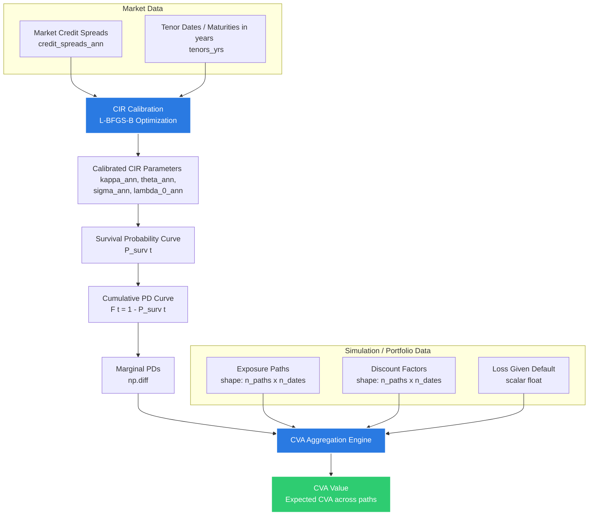

<p align="center">
  
</p>

# XvaSim: Valuation Adjustment (XVA) Simulation & Calculation Engine

`XvaSim` is a lightweight, high-performance Python library designed for simulating and calculating credit and valuation adjustments (XVAs). The core of the library focuses on **Credit Valuation Adjustment (CVA)**, incorporating Cox-Ingersoll-Ross (CIR) credit model calibration and path-wise aggregation.

---

## 🏗️ System Architecture & Workflow

The workflow of the CVA engine consists of two main phases: **Credit Model Calibration** and **Path Aggregation**.



---

## 📐 Units and Conventions

To prevent mismatch and errors, the following uniform conventions are strictly enforced across the codebase:
*   **Time / Tenor**: Represented in **years** (suffix: `_yrs`, e.g., `tenors_yrs`). A 6-month tenor is represented as `0.5`.
*   **Rates / Spreads**: Represented as **annualized decimal values** (suffix: `_ann`, e.g., `credit_spreads_ann`, `lambda_0_ann`). A spread of $2.5\%$ per annum is represented as `0.025`.

---

## 🧮 Mathematical Foundations

### 1. The Hazard Rate Process (CIR Model)
The default intensity (hazard rate) $\lambda_t$ of the counterparty is modeled using the stochastic **Cox-Ingersoll-Ross (CIR)** process:

$$d\lambda_t = \kappa_{\text{ann}}(\theta_{\text{ann}} - \lambda_t)dt + \sigma_{\text{ann}}\sqrt{\lambda_t}dW_t$$

Where:
*   $\kappa_{\text{ann}}$: Annualized speed of mean reversion.
*   $\theta_{\text{ann}}$: Annualized long-term mean hazard rate.
*   $\sigma_{\text{ann}}$: Annualized volatility coefficient of the hazard rate process.
*   $W_t$: Standard Brownian motion.

### 2. Survival Probability
Under the CIR model, the probability of the counterparty surviving up to time $t$ (in years) has a closed-form solution:

$$P_{\text{surv}}(0, t) = A(t) e^{-B(t)\lambda_{0,\text{ann}}}$$

Where $\gamma = \sqrt{\kappa_{\text{ann}}^2 + 2\sigma_{\text{ann}}^2}$ and:

$$A(t) = \left[ \frac{2\gamma e^{(\kappa_{\text{ann}} + \gamma)t/2}}{(\kappa_{\text{ann}} + \gamma)(e^{\gamma t} - 1) + 2\gamma} \right]^{\frac{2\kappa_{\text{ann}}\theta_{\text{ann}}}{\sigma_{\text{ann}}^2}}$$

$$B(t) = \frac{2(e^{\gamma t} - 1)}{(\kappa_{\text{ann}} + \gamma)(e^{\gamma t} - 1) + 2\gamma}$$

### 3. Model-Implied Spreads & Calibration
The model-implied annualized credit spread $S_{\text{model}}(t)$ for a given tenor $t$ (in years) is:

$$S_{\text{model}}(t) = -\frac{\ln(P_{\text{surv}}(0, t))}{t}$$

To calibrate the model, we minimize the sum of squared errors between the model-implied spreads and the observed market credit spreads (both annualized):

$$\min_{\kappa_{\text{ann}}, \theta_{\text{ann}}, \sigma_{\text{ann}}, \lambda_{0,\text{ann}}} \sum_{k=1}^{M} \left( S_{\text{model}}(t_k) - S_{\text{market}}(t_k) \right)^2$$

This multi-dimensional optimization is solved using the **L-BFGS-B** algorithm with parameter bounds to ensure stability ($\kappa_{\text{ann}}, \theta_{\text{ann}}, \sigma_{\text{ann}}, \lambda_{0,\text{ann}} > 0$).

### 4. Credit Valuation Adjustment (CVA)
CVA represents the expected loss due to counterparty default. The discrete CVA for simulated paths is calculated as:

$$\text{CVA} = \text{LGD} \times \frac{1}{N_{\text{paths}}} \sum_{i=1}^{N_{\text{paths}}} \sum_{j=1}^{N_{\text{dates}}} \text{Exposure}_{i,j} \times \text{Marginal PD}_{i,j} \times D_{i,j}$$

Where:
*   $\text{LGD}$: Loss Given Default ($1 - \text{Recovery Rate}$).
*   $\text{Exposure}_{i,j}$: Exposure of path $i$ at date $j$.
*   $\text{Marginal PD}_{i,j}$: Marginal probability of default between date $j-1$ and $j$ for path $i$.
*   $D_{i,j}$: Risk-free discount factor of path $i$ at date $j$.

---

## 📁 Codebase Structure

*   `src/xvasim/`
    *   [`__init__.py`](file:///d:/Projects/XvaSim/src/xvasim/__init__.py): Exposes package public APIs.
    *   [`cva_engine.py`](file:///d:/Projects/XvaSim/src/xvasim/cva_engine.py): Core algorithms for CVA computation, CIR survival probability calculation, calibration, and marginal default probabilities.
    *   [`utils.py`](file:///d:/Projects/XvaSim/src/xvasim/utils.py): Utility functions, including date-to-tenor conversion.
*   `tests/`
    *   [`test_cva_engine.py`](file:///d:/Projects/XvaSim/tests/test_cva_engine.py): Unit test suite covering all aspects of the CVA engine and model calibration.
*   `pyproject.toml`: Modern Python project configuration specifying package metadata, Python versions (>= 3.14), dependencies, and developer tools (`ruff`, `mypy`, `pyrefly`).

---

## 🚀 Installation & Setup

This project uses [uv](https://github.com/astral-sh/uv) for fast, reliable package and environment management.

### Prerequisites
*   Python >= 3.14
*   `uv` installed on your system.

### Install Dependencies
Initialize the virtual environment and install dependencies:
```bash
uv sync
```

---

## 💡 Quick Start Example

Here is an example showing how to calibrate the model to market spreads, compute marginal default probabilities, and run a CVA calculation.

```python
import numpy as np
from xvasim import compute_cva, compute_marginal_pd, dates_to_years

# 1. Dates & Valuation Date
valuation_date = "2026-07-11"
dates = ["2027-07-11", "2028-07-11", "2029-07-11", "2031-07-11", "2033-07-11", "2036-07-11"]

# Convert dates to tenors (in years, based on 365.25 days/year)
tenors_yrs = dates_to_years(dates, valuation_date)

# Market Credit Spreads (Annualized) corresponding to each date
credit_spreads_ann = np.array([0.0150, 0.0180, 0.0210, 0.0250, 0.0270, 0.0300]) # e.g. 1.5% to 3.0% per annum

# 2. Compute Marginal Default Probabilities via CIR Calibration
# This function calibrates the CIR hazard rate process to the spreads and returns 
# the marginal PD for each interval [t_{i-1}, t_i]
marginal_pd_1d = compute_marginal_pd(credit_spreads_ann, tenors_yrs)
print("Marginal Default Probabilities:", marginal_pd_1d)

# 3. Simulate Portfolio Exposures and Discount Factors
n_paths = 1000
n_dates = len(tenors_yrs)

# Generate mock exposure paths (positive part of mark-to-market values)
np.random.seed(42)
exposure = np.random.uniform(10.0, 100.0, size=(n_paths, n_dates))

# Flat risk-free rate of 3.0% per annum
discount_factor_1d = np.exp(-0.03 * tenors_yrs)
discount_factor = np.tile(discount_factor_1d, (n_paths, 1))

# Broadcast marginal PDs to match path dimensionality
marginal_pd = np.tile(marginal_pd_1d, (n_paths, 1))

# 4. Compute CVA assuming LGD = 60%
lgd = 0.60
cva = compute_cva(
    exposure=exposure,
    marginal_pd=marginal_pd,
    discount_factor=discount_factor,
    loss_given_default=lgd
)

print(f"\nCalculated Portfolio CVA: {cva:.6f}")
```

---

## 🧪 Development & Testing

### Running Tests
To run the full test suite using `uv`:
```bash
uv run python -m unittest discover tests
```

### Code Quality Tools
The project enforces strict typing and code quality checks:

*   **Linting & Formatting (Ruff):**
    ```bash
    uv run ruff check .
    ```
*   **Static Type Checking (Mypy):**
    ```bash
    uv run mypy .
    ```
