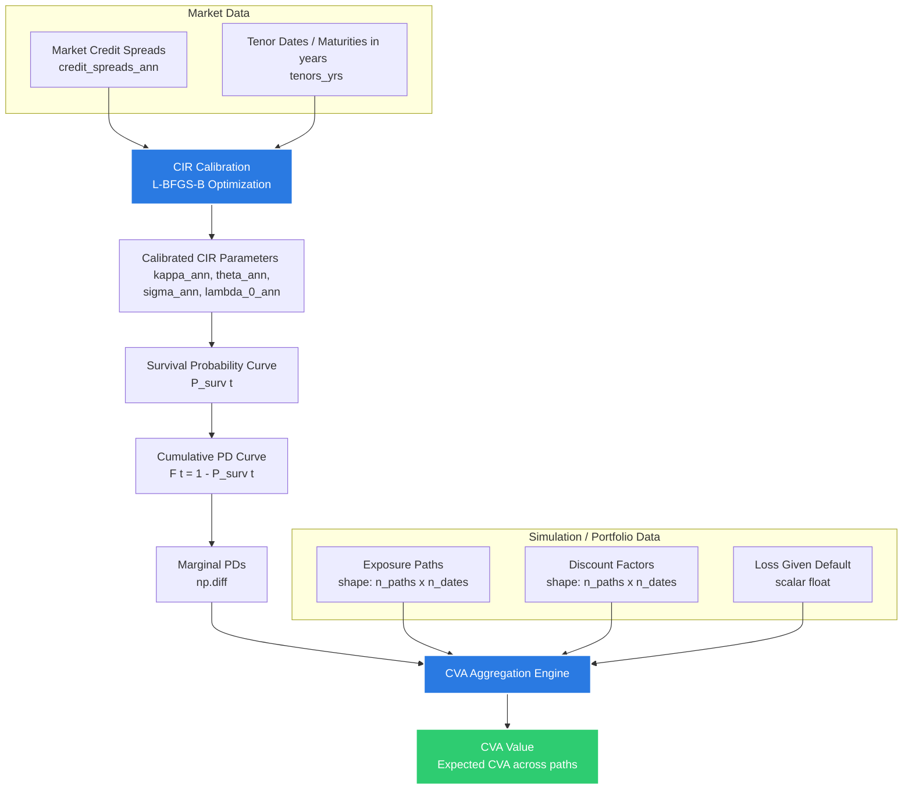

<p align="center">
  
</p>

# XvaSim: Valuation Adjustment (XVA) Simulation & Calculation Engine

`XvaSim` is a lightweight, high-performance Python library designed for simulating and calculating credit and valuation adjustments (XVAs). The library provides:

*   **Credit Valuation Adjustment (CVA)** — Cox-Ingersoll-Ross (CIR) credit model calibration and path-wise aggregation.
*   **FX Derivative Pricing Engine** — Monte Carlo pricing of currency forwards (`price_fx_forward`) and European currency options (`price_fx_option`) using a two-currency **Linear Gauss-Markov (LGM)** model calibrated to swaption market data.

---

## 🏗️ System Architecture & Workflow

The workflow of the CVA engine consists of two main phases: **Credit Model Calibration** (using `CIRParams`) and **Path Aggregation**.



---

## 📐 Units and Conventions

To prevent mismatch and errors, the following uniform conventions are strictly enforced across the codebase:
*   **Time / Tenor**: Represented in **years** (suffix: `_yrs`, e.g., `tenors_yrs`). A 6-month tenor is represented as `0.5`.
*   **Rates / Spreads**: Represented as **annualized decimal values** (suffix: `_ann`, e.g., `credit_spreads_ann`, `lambda_0_ann`). A spread of $2.5\%$ per annum is represented as `0.025`.

---

## 🧮 Mathematical Foundations

### 1. The Hazard Rate Process (CIR Model)
The default intensity (hazard rate) $\lambda_t$ of the counterparty is modeled using the stochastic **Cox-Ingersoll-Ross (CIR)** process:

$$d\lambda_t = \kappa_{\text{ann}}(\theta_{\text{ann}} - \lambda_t)dt + \sigma_{\text{ann}}\sqrt{\lambda_t}dW_t$$

Where:
*   $\kappa_{\text{ann}}$: Annualized speed of mean reversion.
*   $\theta_{\text{ann}}$: Annualized long-term mean hazard rate.
*   $\sigma_{\text{ann}}$: Annualized volatility coefficient of the hazard rate process.
*   $W_t$: Standard Brownian motion.

### 2. Survival Probability
Under the CIR model, the probability of the counterparty surviving up to time $t$ (in years) has a closed-form solution:

$$P_{\text{surv}}(0, t) = A(t) e^{-B(t)\lambda_{0,\text{ann}}}$$

Where $\gamma = \sqrt{\kappa_{\text{ann}}^2 + 2\sigma_{\text{ann}}^2}$ and:

$$A(t) = \left[ \frac{2\gamma e^{(\kappa_{\text{ann}} + \gamma)t/2}}{(\kappa_{\text{ann}} + \gamma)(e^{\gamma t} - 1) + 2\gamma} \right]^{\frac{2\kappa_{\text{ann}}\theta_{\text{ann}}}{\sigma_{\text{ann}}^2}}$$

$$B(t) = \frac{2(e^{\gamma t} - 1)}{(\kappa_{\text{ann}} + \gamma)(e^{\gamma t} - 1) + 2\gamma}$$

### 3. Model-Implied Spreads & Calibration
The model-implied annualized credit spread $S_{\text{model}}(t)$ for a given tenor $t$ (in years) is:

$$S_{\text{model}}(t) = -\frac{\ln(P_{\text{surv}}(0, t))}{t}$$

To calibrate the model, we minimize the sum of squared errors between the model-implied spreads and the observed market credit spreads (both annualized):

$$\min_{\kappa_{\text{ann}}, \theta_{\text{ann}}, \sigma_{\text{ann}}, \lambda_{0,\text{ann}}} \sum_{k=1}^{M} \left( S_{\text{model}}(t_k) - S_{\text{market}}(t_k) \right)^2$$

This multi-dimensional optimization is solved using the **L-BFGS-B** algorithm with parameter bounds to ensure stability ($\kappa_{\text{ann}}, \theta_{\text{ann}}, \sigma_{\text{ann}}, \lambda_{0,\text{ann}} > 0$).

### 4. Credit Valuation Adjustment (CVA)
CVA represents the expected loss due to counterparty default. The discrete CVA for simulated paths is calculated as:

$$\text{CVA} = \text{LGD} \times \frac{1}{N_{\text{paths}}} \sum_{i=1}^{N_{\text{paths}}} \sum_{j=1}^{N_{\text{dates}}} \text{Exposure}_{i,j} \times \text{Marginal PD}_{i,j} \times D_{i,j}$$

Where:
*   $\text{LGD}$: Loss Given Default ($1 - \text{Recovery Rate}$).
*   $\text{Exposure}_{i,j}$: Exposure of path $i$ at date $j$.
*   $\text{Marginal PD}_{i,j}$: Marginal probability of default between date $j-1$ and $j$ for path $i$.
*   $D_{i,j}$: Risk-free discount factor of path $i$ at date $j$.

---

## 🧮 LGM Pricing Engine — Mathematical Foundations

### 1. LGM State Variable
The LGM state variable for each currency evolves under the risk-neutral measure as:

$$dx(t) = -\kappa\,x(t)\,dt + \sigma(t)\,dW(t)$$

where $\kappa$ is the mean-reversion speed and $\sigma(t)$ is a piecewise-constant volatility calibrated to swaptions.

### 2. Discount Bond Prices
The time-$t$ price of a zero-coupon bond maturing at $T$:

$$P(t,T) = \frac{P(0,T)}{P(0,t)}\exp\!\left(-H(T)\,x(t) - \tfrac{1}{2}\bigl(H(T)^2 - H(t)^2\bigr)\zeta(t)\right)$$

with $H(t) = \frac{1-e^{-\kappa t}}{\kappa}$ and $\zeta(t) = \int_0^t \sigma(s)^2 e^{-2\kappa(t-s)}ds$.

### 3. Two-Currency FX Model
The spot FX rate (domestic per foreign) follows:

$$\frac{dS(t)}{S(t)} = (r_d(t) - r_f(t))\,dt + \sigma_{FX}\,dW_{FX}(t)$$

with a quanto drift adjustment on the foreign LGM state to account for measure change.

### 4. Swaption Calibration
The piecewise-constant $\sigma(t)$ is bootstrapped expiry-by-expiry: for each swaption, a Brent root-finding step solves for the volatility segment that matches the market normal (Bachelier) price.

### 5. FX Derivative Payoffs
*   **Currency Forward**: $N \cdot (S(T) - K)$
*   **Currency Call Option**: $N \cdot \max(S(T) - K, 0)$
*   **Currency Put Option**: $N \cdot \max(K - S(T), 0)$

---

## 📁 Codebase Structure

*   `src/xvasim/`
    *   [`__init__.py`](file:///d:/Projects/XvaSim/src/xvasim/__init__.py): Exposes package public APIs (`CIRParams`, `compute_cva`, `compute_marginal_pd`, `dates_to_years`, `LGMParams`, `FXLGMParams`, `calibrate_lgm_to_swaptions`, `price_fx_forward`, `price_fx_option`).
    *   [`cva_engine.py`](file:///d:/Projects/XvaSim/src/xvasim/cva_engine.py): Core algorithms for CVA computation, CIR survival probability calculation (using the `CIRParams` dataclass), calibration, and marginal default probabilities.
    *   [`pricing_engine.py`](file:///d:/Projects/XvaSim/src/xvasim/pricing_engine.py): LGM-based Monte Carlo pricing engine for currency forwards (`price_fx_forward`) and European FX options (`price_fx_option`), including swaption calibration. Defines the `LGMParams` and `FXLGMParams` dataclasses.
    *   [`utils.py`](file:///d:/Projects/XvaSim/src/xvasim/utils.py): Utility functions, including date-to-tenor conversion (`dates_to_years`).
*   `tests/`
    *   [`test_cva_engine.py`](file:///d:/Projects/XvaSim/tests/test_cva_engine.py): Unit test suite covering all aspects of the CVA engine and model calibration.
    *   [`test_pricing_engine.py`](file:///d:/Projects/XvaSim/tests/test_pricing_engine.py): Unit tests for the LGM pricing engine (helpers, forward convergence, put-call parity, calibration round-trip).
    *   [`test_utils.py`](file:///d:/Projects/XvaSim/tests/test_utils.py): Unit tests for utility functions (date-to-years conversion).
*   `pyproject.toml`: Modern Python project configuration specifying package metadata, Python versions (>= 3.14), dependencies, and developer tools (`ruff`, `mypy`, `pyrefly`).

---

## 🚀 Installation & Setup

This project uses [uv](https://github.com/astral-sh/uv) for fast, reliable package and environment management.

### Prerequisites
*   Python >= 3.14
*   `uv` installed on your system.

### Install Dependencies
Initialize the virtual environment and install dependencies:
```bash
uv sync
```

---

## 💡 Quick Start Examples

### CVA Calculation

Calibrate the CIR credit model to market spreads, compute marginal default probabilities, and run a CVA calculation.

```python
import numpy as np
from xvasim import compute_cva, compute_marginal_pd, dates_to_years

# 1. Dates & Valuation Date
valuation_date = "2026-07-11"
dates = ["2027-07-11", "2028-07-11", "2029-07-11", "2031-07-11", "2033-07-11", "2036-07-11"]

# Convert dates to tenors (in years, based on 365.25 days/year)
tenors_yrs = dates_to_years(dates, valuation_date)

# Market Credit Spreads (Annualized) corresponding to each date
credit_spreads_ann = np.array([0.0150, 0.0180, 0.0210, 0.0250, 0.0270, 0.0300]) # e.g. 1.5% to 3.0% per annum

# 2. Compute Marginal Default Probabilities via CIR Calibration
# This function calibrates the CIR hazard rate process to the spreads and returns 
# the marginal PD for each interval [t_{i-1}, t_i]
marginal_pd_1d = compute_marginal_pd(credit_spreads_ann, tenors_yrs)
print("Marginal Default Probabilities:", marginal_pd_1d)

# 3. Simulate Portfolio Exposures and Discount Factors
n_paths = 1000
n_dates = len(tenors_yrs)

# Generate mock exposure paths (positive part of mark-to-market values)
np.random.seed(42)
exposure = np.random.uniform(10.0, 100.0, size=(n_paths, n_dates))

# Flat risk-free rate of 3.0% per annum
discount_factor_1d = np.exp(-0.03 * tenors_yrs)
discount_factor = np.tile(discount_factor_1d, (n_paths, 1))

# Broadcast marginal PDs to match path dimensionality
marginal_pd = np.tile(marginal_pd_1d, (n_paths, 1))

# 4. Compute CVA assuming LGD = 60%
lgd = 0.60
cva = compute_cva(
    exposure=exposure,
    marginal_pd=marginal_pd,
    discount_factor=discount_factor,
    loss_given_default=lgd
)

print(f"\nCalculated Portfolio CVA: {cva:.6f}")
```

### FX Option Pricing with LGM Model

Calibrate the LGM volatility to swaptions, build a two-currency model, and price a European FX call option via Monte Carlo.

```python
import numpy as np
from xvasim import (
    LGMParams, FXLGMParams, OptionType,
    calibrate_lgm_to_swaptions, price_fx_option,
)

# 1. Discount curves (flat 3% domestic, 1% foreign)
curve_yrs = np.array([0.0, 1.0, 2.0, 5.0, 10.0, 30.0])
dom_dfs = np.exp(-0.03 * curve_yrs)
for_dfs = np.exp(-0.01 * curve_yrs)

# 2. Calibrate domestic LGM to swaption normal vols
#    (expiry × tenor pairs with market Bachelier vols)
expiries = np.array([1.0, 2.0, 5.0])        # swaption expiries (years)
swap_tenors = np.array([5.0, 5.0, 5.0])     # underlying swap tenors
market_vols = np.array([0.0050, 0.0055, 0.0060])  # normal vols (annualised)
fixed_rates = np.full(3, 0.03)               # ATM swap rates

dom_lgm = calibrate_lgm_to_swaptions(
    swaption_expiries_yrs=expiries,
    swap_tenors_yrs=swap_tenors,
    market_normal_vols_ann=market_vols,
    curve_yrs=curve_yrs,
    curve_dfs=dom_dfs,
    fixed_rates_ann=fixed_rates,
    kappa_ann=0.03,
)
print("Calibrated domestic σ(t):", dom_lgm.sigma_values_ann)

# 3. Foreign LGM (use pre-calibrated constant σ for simplicity)
for_lgm = LGMParams(
    kappa_ann=0.03,
    sigma_grid_yrs=np.array([30.0]),
    sigma_values_ann=np.array([0.008]),
    discount_curve_yrs=curve_yrs,
    discount_factors=for_dfs,
)

# 4. Assemble two-currency FX model
fx_params = FXLGMParams(
    domestic=dom_lgm,
    foreign=for_lgm,
    spot_fx=1.10,        # e.g. EUR/USD
    fx_vol_ann=0.10,     # 10% FX vol
    correlation_matrix=np.array([
        [1.0,  0.3, -0.2],   # dom_rate
        [0.3,  1.0,  0.1],   # for_rate
        [-0.2, 0.1,  1.0],   # fx_spot
    ]),
)

# 5. Price a 1-year European FX call option
result = price_fx_option(
    params=fx_params,
    strike=1.12,
    maturity_yrs=1.0,
    notional=1_000_000,
    option_type=OptionType.CALL,
    n_paths=100_000,
    n_steps=100,
    seed=42,
)

print(f"FX Call Price: {result['price']:,.2f}")
print(f"Std Error:     {result['std_error']:,.2f}")
```

---

## 🧪 Development & Testing

### Running Tests
To run the full test suite using `uv`:
```bash
uv run python -m unittest discover tests
```

### Code Quality Tools
The project enforces strict typing and code quality checks:

*   **Linting & Formatting (Ruff):**
    ```bash
    uv run ruff check .
    ```
*   **Static Type Checking (Mypy):**
    ```bash
    uv run mypy .
    ```
